# PP5 - Console Geeks

## Introduction
Console Geeks is a platform content sharing site where users can come to to talk about their favourite tops in the console and gaming world. It can be categorised across Playstation, Xbox, Nintendo, PC and Tech so once a user uploads a post, they can mark the category so it can be easily filtered out for other users.

DEPLOYED FRONTEND (HEROKU) - [CLICK HERE](https://ck-fsd-console-geeks-pp5.herokuapp.com/)

DEPLOYED API (HEROKU) - [CLICK HERE](https://ck-fsd-console-geeks.herokuapp.com/)

DEPLOYED BACKEND REPOSITORY - [CLICK HERE](https://github.com/ChrisKellFSD/console-geeks-api)

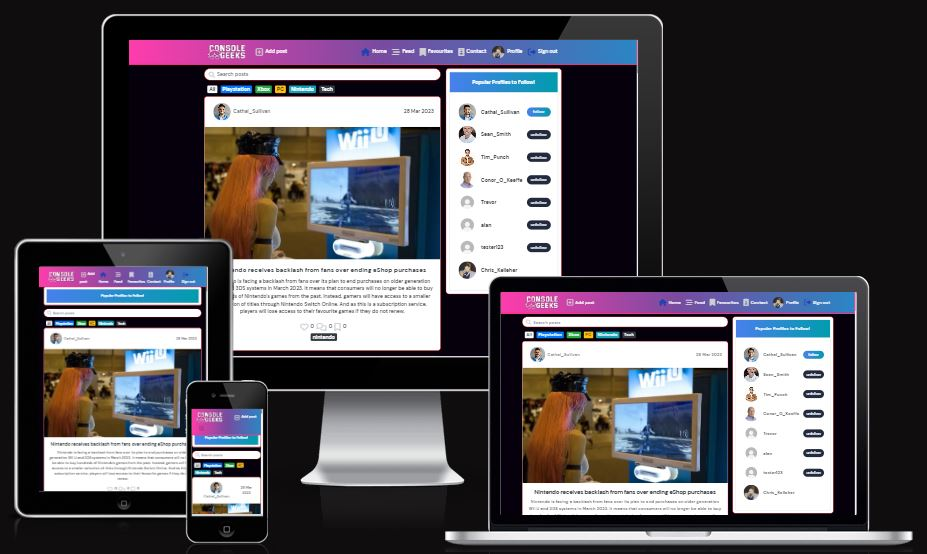

## Table of Contents
- [User Experience (UX)](#user-experience)
    - [Site Purpose](#site-purpose)
    - [Site Goals](#site-goals)
    - [Epics](#epics)
    - [User Stories](#user-stories)
- [Design](#design)
    - [Wireframes](#wireframes)
    - [Colour Scheme](#color-scheme)
    - [Fonts](#fonts)
- [Agile](#agile)
- [Features](#features)
    - [Homepage](#homepage)
    - [Homepage - Mobile](#homepage---mobile)
    - [NavBar](#navbar)
    - [Sign in, Sign out and Sign up](#sign-in-sign-out-and-sign-up)
    - [Posts](#posts)
    - [Reviews](#reviews)
    - [Events](#events)
    - [Profiles](#profiles)
    - [About](#about)
- [Future Development](#future-development)
- [Components](#components)
- [Testing](#testing)
    - [Manual Testing](#manual-testing)
    - [Browser and Device Testing](#browser-and-device-testing)
    - [W3C Validator](#w3c-validatior)
    - [ES Lint](#es-lint)
    - [Colour Contrast Checks](#colour-contrast-checks)
    - [Lighthouse Tool](#lighthouse-tool)
- [Solved Bugs](#solved-bugs)
- [Known Bugs](#known-bugs)
- [Technologies Used](#technologies-used)
    - [Languages Used](#languages-used)
    - [Frameworks, Libraries and Programs](#frameworks-libraries-and-programs)
    - [Databases](#databases)
- [Deployment](#deployment)
    - [Workspace and Deployment Setup](#workspace-and-deployment-setup)
    - [Connecting to API](#connecting-to-api)
    - [Deploying to Heroku](#deploying-to-heroku)
    - [Forking Repository](#forking-repository)
    - [Cloning Repository](#cloning-repository)
- [Credits](#credits)
    - [Content](#content)
    - [Media](#media)
    - [Resources](#resources)
    - [Acknowledgements](#acknowledgements)


## User Experience
### Site Purpose
The purpose of the site is for users to be able to come to a platform that they can share their ideas and articles based around the video game community. 'Console Geeks' was a brand created to represent this as consoles are at the fore front of all gaming activities. 

### Site Goals
- To give users the latest information on the gaming community
- To create a space where a community of console geeks can gather
- To give users a chance to meet new like minded people online


## User Stories - Completed

A list of my user stories and their tasks can be found [here](https://github.com/ChrisKellFSD/console-geeks/issues).

- As a user I can Fill out a contact form so that I can send a message if I want to
- As a user I can edit my profile information' so that I can update it if I wish
- As a user I can click on my profile so that I can see the information I have listed
- As a user I can read other users comments so that I can know what they thought of the post
- As a user I can click on the 'Delete' icon so that I can delete my posts if I wish
- As a user I can click on the 'Edit' icon so that I can edit my posts in case I need to change or update the information
- As a user I can click the 'follow' button next to a users name so that I can follow and interact with their content
- As a user I can click on the Category tabs' so that I can filter the posts I want to view by their category
- As a user I can click on the post search bar so that I can quickly find a post of interest to me
- As a user I can have some CRUD functionality on my comments' so that I can edit or delete them I want to
- As a user I can comment on a post so that I can interact with the posting with other users
- As a user I can click on the 'Favourite' icon so that I save all the posts I favourited to access them in the nav bar when I want to
- As a user I can click on the 'Like' icon so that I like a post or unlike it after to let the author know how I felt about it
- As a user I can click on a post so that I can interact with it more
- As a user I can view every post' so that I can interact with them if I so want to
- As a user I can click on 'Add Post' so that I can create a new post that will be posted to the websites posts page for all to see
- As a user I can stay logged in for a long period of time so that I don't get logged out unexpectantly
- As a user I can see my profile avatar' so that I know it is my account I am logged into
- As a user I can click on the different nav links so that I can switch between the pages I want to access
- As a user I can click on the 'Sign Out button'' so that I can sign out of my account
- As a user I can login into my account' so that I can access my personal account page
- As a user I can create an account so that I can access the site's full functionality and begin interacting with other users
- As a guest I can view the page' so that I can create a new account to interact with other users

## User Stories - Future implementation

These are user stories I would like to implement in the future.

- As a user I can click on 'Forgot Password' so that I can create a new password for my account
- As a user I can message other users so that I can interact with them more
- As a user I can get notifications on my account

## Agile

I used an Agile approach when planning out the project. I came up with 23 user stories that were looked at and completed as mini epics. Moving each user story from To Do - In Progress - Complete really gave me a sense of accomplishment and helped to keep me focused on my task at hand. I used various sprints to help with my project by setting myself short goals to accomplish in the project. Step 1 was getting the api set up and speaking to the front end, step 2 was getting the front end to an acceptable level that all functionality worked. Step 3 was implementing the styling for the site. Step 4 was to clean up any bugs and errors that showed up in the project. Doing this helped to keep me focussed on my tasks throughout.

This is the board that I used throughout my project to help with my planning.

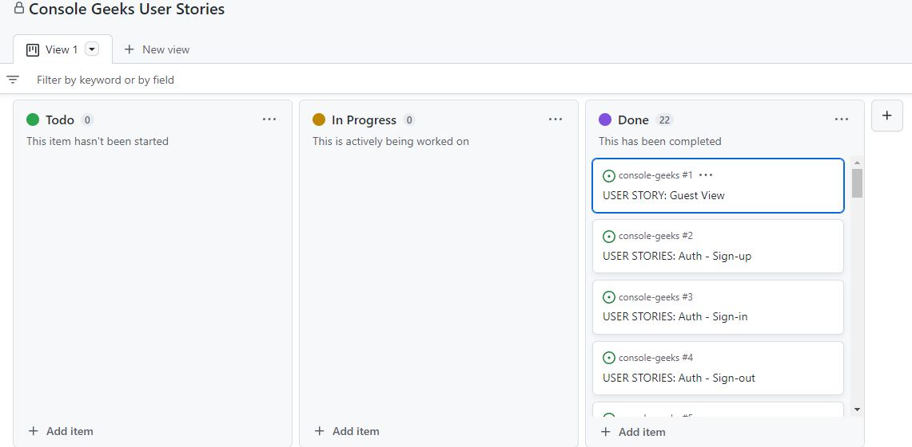

## Design
### Wireframes
- Desktop
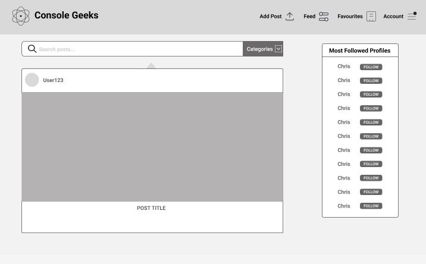

- Mobile
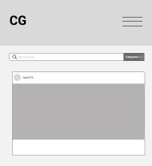

- Sign In
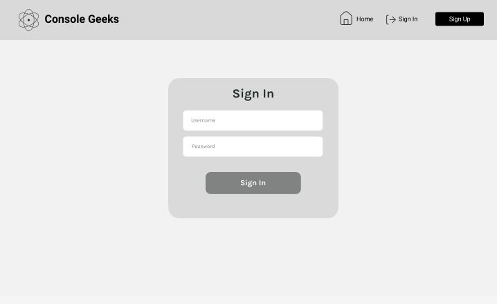

- Sign Up
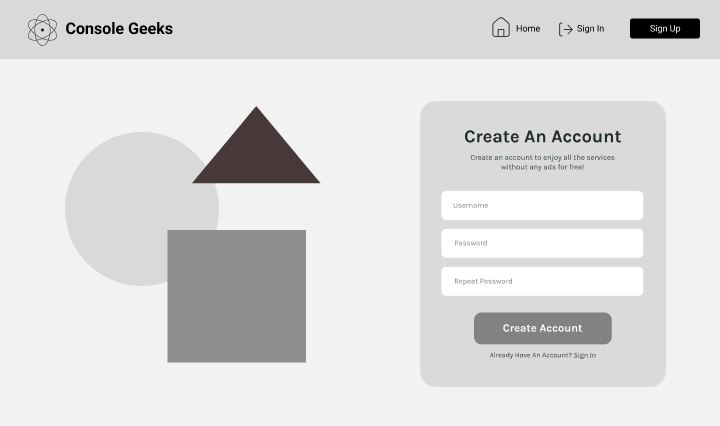


### Logo / Colour Scheme

Various colours were used throughout the site and gradients were used heavily. I went with gradients of the brighter nature, pinks, blues, purples as well as black as the main background colour. This was to give off a sci fi type setting which would work in conjunction with the bright colours of the logo.

I created the logo for the site with Adobe Illustrator.

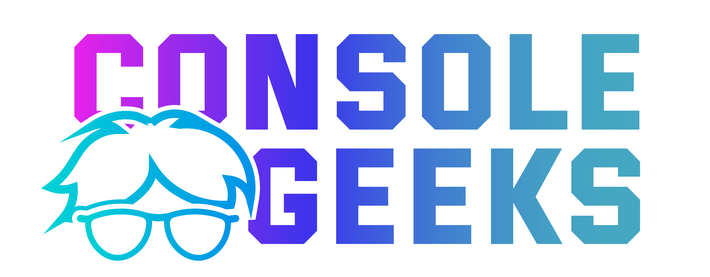


### Fonts
The font used in this project was DM Sans with a backup of sans-serif. It was chosen for its easy readability for users. Fonts were imported using Google Fonts.

## Features

### Sign Up
The Sign up shows clear indication for the user on what options they have availble to them. They can select a username, password and repeat the password before signgin up. If they already have an account, they can click on the sign in button below. I've also reinforced the branding by creating a nice little graphic to be next to the form.


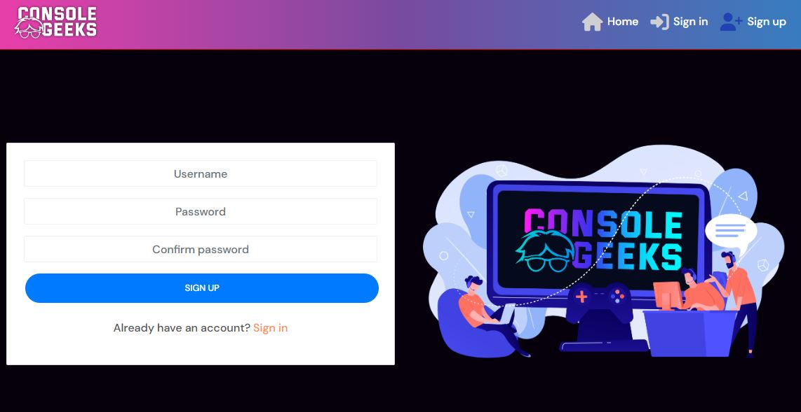


### Sign In
The sign in form is very similar to the sign up form. Again, there is a new graphic to go alongside the form just to give the user a visual indication that they are on a different page.


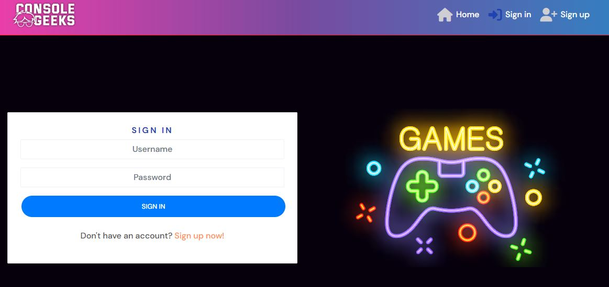

### Homepage
The homepage is where all the post information, search/filtering, popular profiles and navbar are located. It boasts a very colourful scheme with nicely contrasted text and icons to help the users ux journey throughout the site. Also here is the search bar for seaching posts by names or the category tabs so a user can filter the posts by the type of post they want to see.


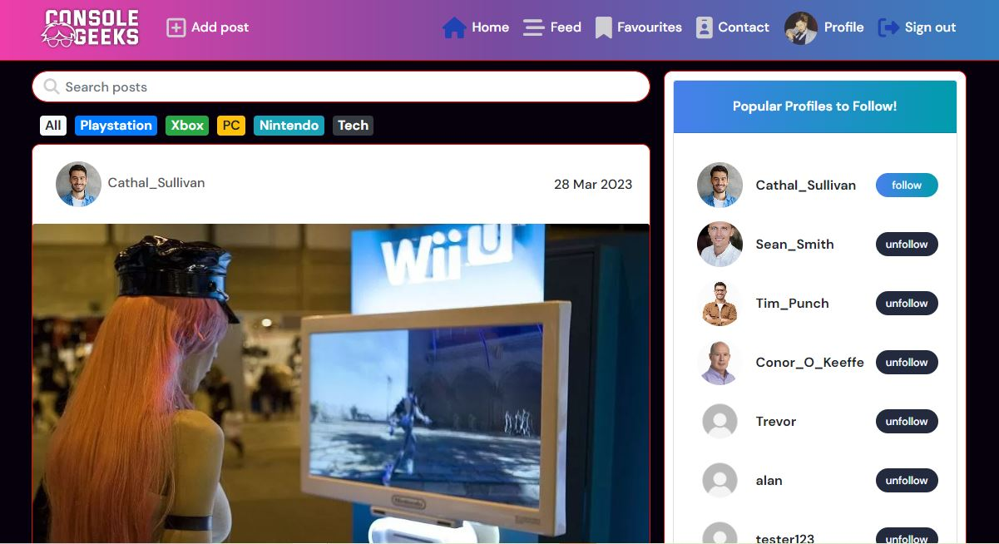

### Feed
The feed is where you can see users posts who you have followed. This is a nice way of filtering the content to ones you only want to see if you like a particular users postings.


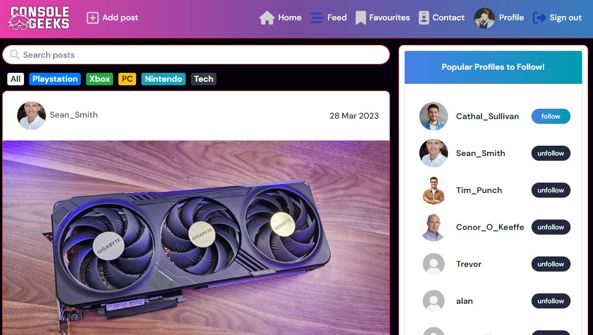

### Favourites / Liking
One of the nice features with the posts is to like / unlike and favourite a post. The liking is to let the owner and other users know if the general users liked the posts. If you as a user, like a particular post so much that you want to save it to your favourites page, you can click on the favourite icon at the end of the post and when you click on Favourites in the navbar, all your favourited posts will be stored on this page.


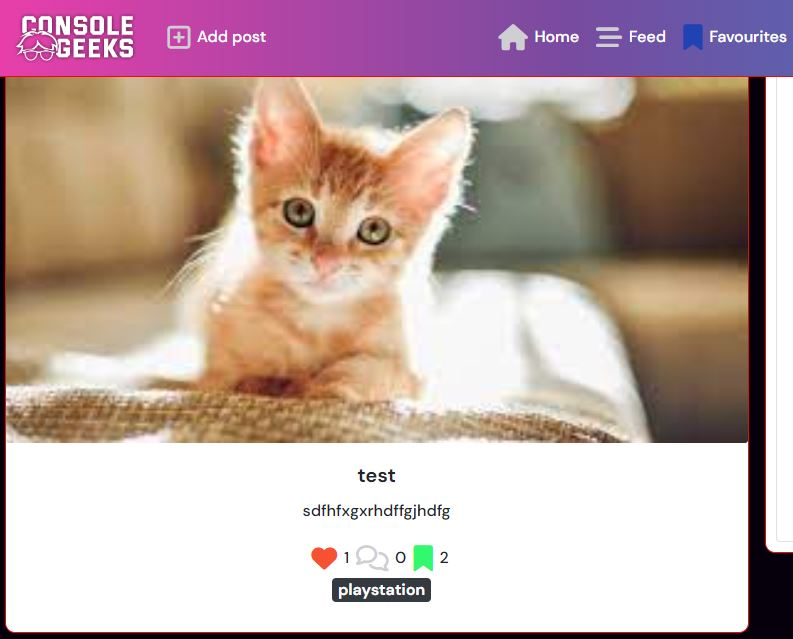

### Contact
This contact page acts as a form that a user can fill out so they can contact the site, whether its for a general enquiry or even a complaint. From the users perspective, this gives them a line of communication between them and the owner of the site.


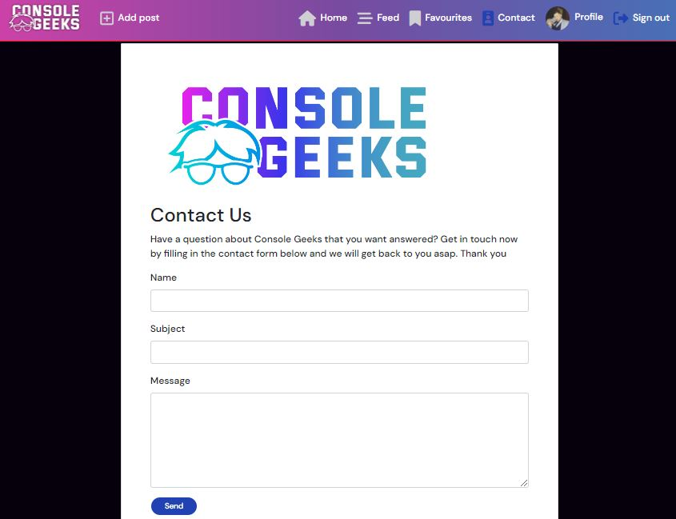

### Profile
The profile page is nicely designed with headings of Posts, Followers and Following along with the number for each. As well as that there is space for a bio. If you click on another users page, you can choose to follow them here if you haven't done so already in the popular profiles tab on the homepage. Also on the profile page, you can see all of the users posts here if you just want to isolate their posts to view. As well as that, if you are on your own profile, you have a chance to click on the mini dropdown to the right that lets you edit your profile, username and password.


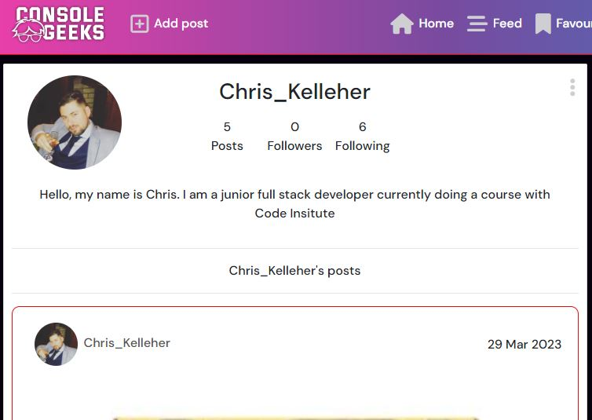
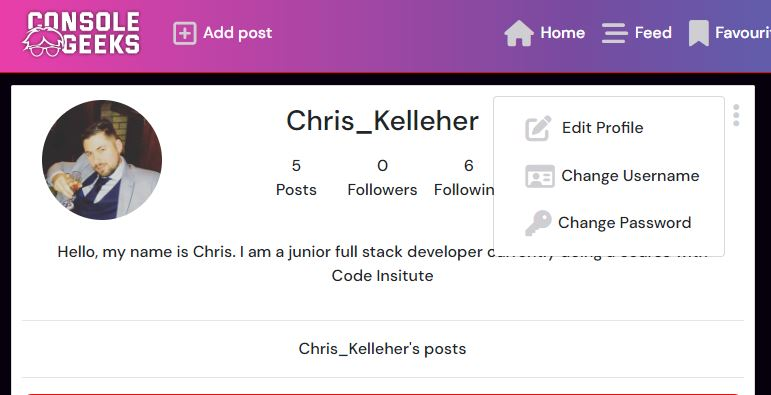
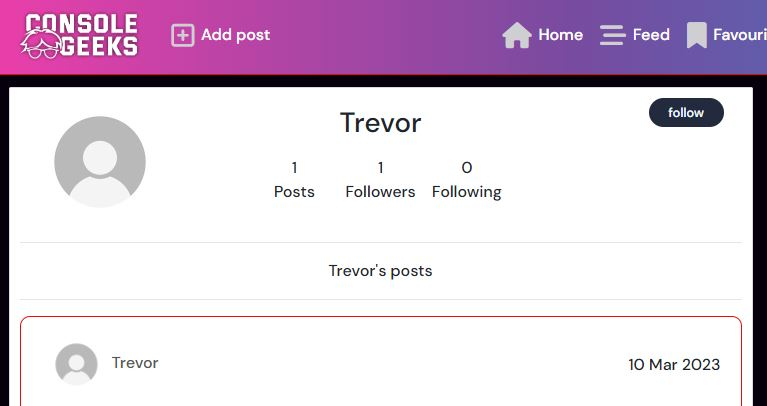

### Post
The post page is simple in nature, it shows the boxes the users need to fill out as well as the dropdown menu for the category and the upload image button to prompt the user where to click. The edit post screen looks identical to this one.


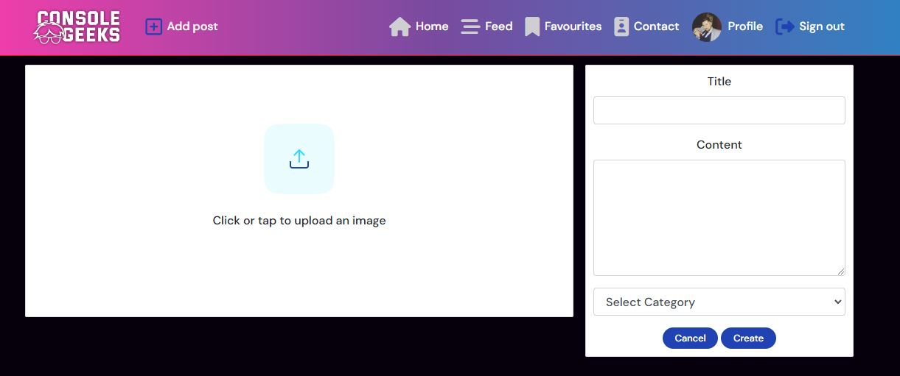

### Navbar
The nav bar is the most colourful aspect of the site. It holds within it all the links the user can access. It changes states when the user is not logged in versus when they are. When they are not logged in or are a new user to the site, they can only see the links home, sign in and sign up. Whereas if they are logged in, the rest of the links are availble for them to click on to access each page.


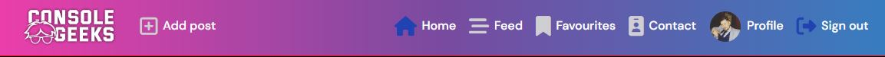

### Comments
The comments section looks simple in nature also. It lets users comment on other users posts as well as gives them the ability to edit or even delete a post if they so wish.


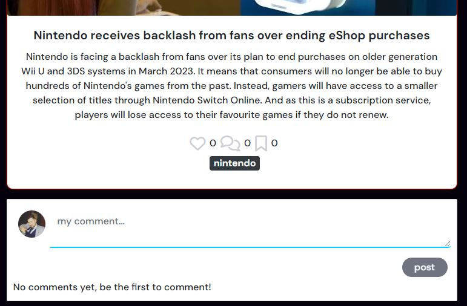
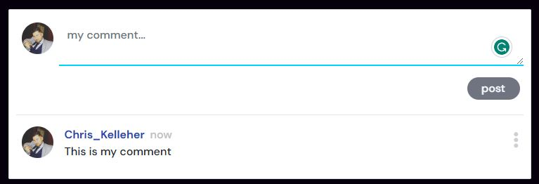
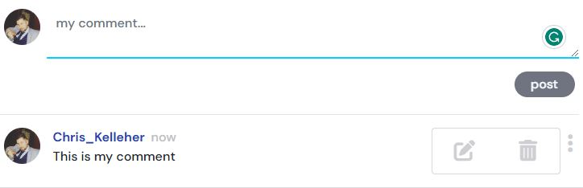

### Popular Profiles
The popular profiles tab is a nice little feature to the right on desktop or at the top of the page in mobile view. It acts as an accordion style drop down so it can be clicked on to minimize. It shows all the popular profiles the user can follow and shows each user name with the follow / unfollow buttons.


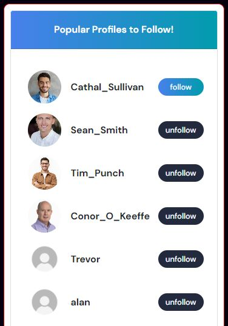
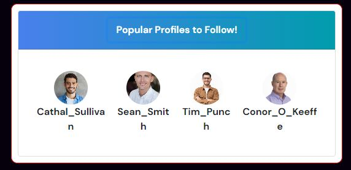
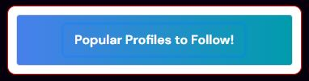

## Future Development
- I would have liked to have a side nav and wanted to use the bootstrap one but was only availble in the newest version. As I was working with an older version of bootstrap, I didn't think it was worth potentially breaking some bootstrap elements (The accodion component for example has different naming conventions in newer versions). 
- Private messaging between users
- The ability to create groups
- Notifications for when a user receives a new follow, comment or like

## Components
A wide selection of components have been implemented throughout this project and reused on multiple pages:

- Asset.js - ther loading spinner that is used throughout when components are loading
- Avatar.js - this component adds each users individualy profile photo to their avatar icon
- axiosDefault.js - this is used to help the front end communicate with the back end api
- CurrentUserContext.js - this confirms that the user is logged in
- MoreDropdown.js - this lets the user edit the information on posts, comments
- NavBar.js - this component is a constant on all pages and is always shown at the top of the screen
- NotFound.js - this component used to store the custom 404 not found page when a user enters an invalid url
- ProfileDataContext.js - provides the functionality for the follow / unfollow
- useRedirect.js - this redirects the user to another page
- utils.js - this provides the functionality for all the components as well as the infinite scroll

## Testing

Testing and results can be found [here](TESTING.md)


## Bugs

Throughout my project, my NavBar contained a bootstrap dropdown component to make it look neater for the Account options. The user would click on 'Account' and get another dropdown for Profile, Contact and Sign Out. Unfortunately, I noticed that on mobile screens, the dropdown for Account didn't work. I took it out due to time contraints but would like to implement it correctly in the future.

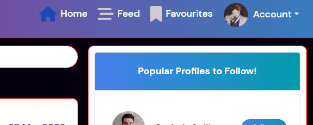
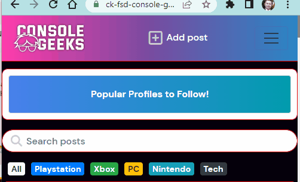


## Technologies Used
### Languages Used
- [HTML5](https://developer.mozilla.org/en-US/docs/Glossary/HTML5)
- [CSS3](https://developer.mozilla.org/en-US/docs/Web/CSS)
- [JavaScript](https://developer.mozilla.org/en-US/docs/Web/JavaScript)
- [Python](https://www.python.org/)
- [PostgreSQL](https://www.postgresql.org/)

### Frameworks, Libraries and Programs
- [Heroku](https://www.heroku.com/)
- [Django](https://www.djangoproject.com/)
- [ReactJS](https://reactjs.org/)
- [React-Bootstrap](https://react-bootstrap-v4.netlify.app/)
- [Gitpod](https://gitpod.io/projects)
- [Git](https://git-scm.com/)
- [GitHub](https://github.com/)
- [Am I Resposive](https://ui.dev/amiresponsive)
- [Google Fonts](https://fonts.google.com/)
- [Font Awesome](https://fontawesome.com/)
- [Figma](https://figma.com/)
- [GoogleDev Tools](https://developer.chrome.com/docs/devtools/)
- [Freepik](https://www.freepik.com/)
- [Favicon.io](https://favicon.io/favicon-generator/)

### React Bootstrap Front end library
- Throughout the project, I relied on react bootrap for my styling as I found it very user friendly to deal with. As well as that there was plenty of documentation to assist me whenever I got stuck. Being one of the most popular front end libraries, any issues I had when search for instance on Stack Overflow, the answer was always there to help with my issue,
 
### Databases
- SQLite: local database used to test during development
- PostgreSQL: database used in Heroku to store data on deployment

## Deployment
This application has been deployed using Heroku by following these steps:

### Workspace and Deployment Setup

1. Create a new repository on GitHub
2. Create a new Gitpod workspace
3. Once the workspace has been loaded, run the following command, enter y to confirm installing the create-react-app package and wait until all packages have been installed. This will pre-install all necessary packages to make your project work.

```
npx create-react-app . --template git+https://github.com/Code-Institute-Org/cra-template-moments.git --use-npm
```

 - Alternatively, you can use the following however, you may see different outcomes to this project as the dependencies will be different versions.

```
npx create-react-app . --use-npm
```

4. Once the app has installed, run the terminal command ```npm start``` to check the app is working.
5. Remove the React default logo import in App.js and replace the React header with a custom h1 element containing some test text
6. Confirm changes have rendered correctly to browser preview and add, commit and push changes to GitHub
7. Create a new app in Heroku
8. Click on the 'Deploy' tab and go to 'Deployment Method' and choose GitHub
9. Navigate to 'App connected to GitHub' and search for the relevant repository
10. Select the repository you wish to deploy and click 'Connect'
11. Navigate to 'Manual Deploy' and click 'Deploy Branch'
12. Check the build logs to monitor the build and ensure deployment is successful
13. The build is complete when the log states 'Build succeeded!'
14. Click the 'Open App' button to view deployed app
15. Navigate to Gitpod, and install react-bootstrap by running the following terminal command:

```
npm install react-bootstrap@1.6.3 bootstrap@4.6.0
```

### Connecting to API
1. Navigate to your Heroku app for your DRF-API project and under the 'Settings' tab add the following config vars:
- Key: Client_Origin | Value: [https://react-app-name.herokuapp.com](https://react-app-name.herokuapp.com)
- Key: Client_Origin_Dev | Value: [https://your-gitpod-browser-link.ws-eu73.gitpod.io](https://your-gitpod-browser-link.ws-eu73.gitpod.io)

2. Ensure that the trailing ```\``` is removed from the end of both links and save the config vars
3. Install the Axios package, and create the supporting ```axiosDefaults.js``` file

### Deploying to Heroku
1. If you have used the dependencies template method in point 3 of the pre-deployment steps you do not need to do points 2 or 3. Please skip to point 4
2. Navigate to package.json in Gitpod and in the scripts section add the following command:
```
"heroku-prebuild": "npm install -g serve,"
```
3. Add a Procfile to the root of the project with the following:
```
web: serve -s build
```
4. Add the following code to your package.json file:
```
"engines": {
"node": "16.14.2",
"npm": "8.5.0"
}
```
5. Git add, commit and push your code
6. Navigate to Heroku and deploy the project via the deploy button under the 'Deploy' tab


### Forking Repository
You can fork the GitHub repository to make a copy of the original to view and change without affecting the original. This can be done by:

1. Log into GitHub or create an account
2. Locate the repository you want to fork
3. At the top of the repository, on the right-hand side of the page you will see an option to select "Fork" from the available buttons
4.  Click the fork button and a copy of the repository will have been created

### Cloning Repository
You can create a clone of your repository by:

1. Locate the repository you wish to clone
2. Click the arrow on the 'Code' button at the top of the list of files
3. Select the clone by HTTPS and copy the URL using the provided clipboard
4. Navigate to your chosen code editor and within the terminal change the directory to the location your to clone the repository to
5. Type 'git clone' and paste the HTTPS link you copied from GitHub
6. Press enter and git will clone the repository to your local machine

## Credits
### Content 
Content for the posts were taken from ign and other news sites for educational purposes only and are not to be passed off as my own articles:
- [IGN](https://www.ign.com/)
- [BBC](https://www.bbc.co.uk/)
- [Games Radar](https://www.gamesradar.com/) 

### Media
Various images were taken from Freepik for educational purposes only and are not to be passed off as my own images:
- [Freepik](https://www.freepik.com/)

### Code
Code was adapted from checking out react bootstraps online documentation
- [Accordion](https://react-bootstrap-v4.netlify.app/components/accordion/)
- [Badge](https://react-bootstrap-v4.netlify.app/components/badge/)
- [Form](https://react-bootstrap-v4.netlify.app/components/forms/)

### Credits & Resources
- The moments walkthrough was the bulk of the project with the customization added on top of it.
- Tutor Support
- [Stack Overflow](https://stackoverflow.com/) - was used to help solve small issues
- [React Documentation](https://reactjs.org/) - used to improve understanding of concepts

## Acknowledgements

- I would like to thank <a href="https://github.com/10xOXR">Chris Quinn</a> for helping me throughout this project. His guide and insight helped me greatly along the way and it is very much appreciated.

- My wife for sticking by me throughout the course