# Console Geeks - Testing

## Contents 

- [Validators](#validators)
- [User story testing](#user-story-testing)
- [Automated Testing](#automated-testing)
- [Manual Testing](#manual-testing)

## Validators
- HTML
    - I ran the website through [w3c](https://validator.w3.org/nu/?doc=https%3A%2F%2Fck-fsd-console-geeks-pp5.herokuapp.com%2F) and no errors were reported.
    

- CSS 
     - No errors were found when passing through the official [(Jigsaw) validator](https://jigsaw.w3.org/css-validator/validator?uri=https%3A%2F%2Fck-fsd-console-geeks-pp5.herokuapp.com%2F&profile=css3svg&usermedium=all&warning=1&vextwarning=&lang=en)

     

- CI Linter
    - CI's linter was downloaded and major probles were corrected throughout the project. There would be minor ones like whitespace that would arise but would be sorted upon notice.

- Lighthouse

    

## User Story / Project Goals Testing

*As a user I can Fill out a contact form so that I can send a message if I want to
- This is ddone by clicking on the Contact link in the Navbar. The user is then shown a form that they can fill out to contact the site owner.

*As a user I can edit my profile information' so that I can update it if I wish
- This is done by clicking on the profile link in the Navbar and clicking the 3 dots on the right. Once this is clicked on you can see the options available to edit your profile

*As a user I can click on my profile so that I can see the information I have listed
- This can be done by clicking on the Profile link in the Navbar.

*As a user I can read other users comments so that I can know what they thought of the post
- Yes, this can be done by clicking on any users posts to reveal the comments below the posting.

*As a user I can click on the 'Delete' icon so that I can delete my posts if I wish
- This is done by clicking on the 3 dots icons on the top right hand side of the screen.

*As a user I can click on the 'Edit' icon so that I can edit my posts in case I need to change or update the information
- This is done by clicking on the 3 dots icons on the top right hand side of the screen.

*As a user I can click the 'follow' button next to a users name so that I can follow and interact with their content
- You can do this in two places. 1st is in the popular profiles tab on the righthand side of the home page. The 2nd is when you click on a users profile, you can see the follow option at the top of the page where the 3 dots would be if it was your own page.

*As a user I can click on the Category tabs' so that I can filter the posts I want to view by their category
- On the home page underneath the search bar, you will see all the categories in a badge format that you can click on the title of the category to filter the results.

*As a user I can click on the post search bar so that I can quickly find a post of interest to me
- On the main page you will see the search bar and you can use this to search for a post by typing in it

*As a user I can have some CRUD functionality on my comments' so that I can edit or delete them I want to
- Once you create a comment, you will see the 3 dots that if clicked on, will give the user the option to either edit or delete their comment

*As a user I can comment on a post so that I can interact with the posting with other users
- This can bedone by clicking on the post and underneath it you will see the space where you can leave a comment

*As a user I can click on the 'Favourite' icon so that I save all the posts I favourited to access them in the nav bar when I want to
- At the end of a post, you will see 3 small icons in the center below the posts title and content. It will show likes, comments and favourite counts. If you click on the favourite icon, it will be automatically added to your favorites list that you can get to by clicking on the link in the Navbar.

*As a user I can click on the 'Like' icon so that I like a post or unlike it after to let the author know how I felt about it
- At the end of a post, you will see 3 small icons in the center below the posts title and content. It will show likes, comments and favourite counts. If you click on the likes icon, it will change from an outline icon to a filled in heart icon. This shows the user that they have liked the post. If they click on it again, they will unlike the post.

*As a user I can click on a post so that I can interact with it more
- When a user clicks on a post, more options for interacting with the post will open up for them. For example, liking, unliking, favouriting or commenting.

*As a user I can view every post' so that I can interact with them if I so want to
- At the home page, all posts will be shown to the viewer. On the feed page, only posts from followed users will be shown here.

*As a user I can click on 'Add Post' so that I can create a new post that will be posted to the websites posts page for all to see
- This button is in the Navbar just right of the logo. It is there so it stands out.

*As a user I can stay logged in for a long period of time so that I don't get logged out unexpectantly
- This is achieved with the correct set up of the JWT tokens and tests have confirmed this works.

*As a user I can see my profile avatar' so that I know it is my account I am logged into
- Once a user is logged in, they will see their image, if they uploaded one, in a small circular icon next to the Profile link.

*As a user I can click on the different nav links so that I can switch between the pages I want to access
- Yes, this is easily achieved by clicking on the links in the Navbar.

*As a user I can click on the 'Sign Out button'' so that I can sign out of my account
- Yes, I can confirm this works as expected.

*As a user I can login into my account' so that I can access my personal account page
- Yes, I can confirm this works as expected. Once you enter your username and password you will be shown as logged in.

*As a user I can create an account so that I can access the site's full functionality and begin interacting with other users
Yes, once you click on the Sign Up link, you will be brought to that page so that you can sign up to an account.

*As a guest I can view the page' so that I can create a new account to interact with other users
- Any guest can view the homepage as I left it available on the Navbar. The user just won't  be able to interact with other users unless they set up an account of their own.

## Automated testing

Due to time constraints, I did not create any unique automated tests. The ones conducted are the same as shown in the Moments walkthrough project

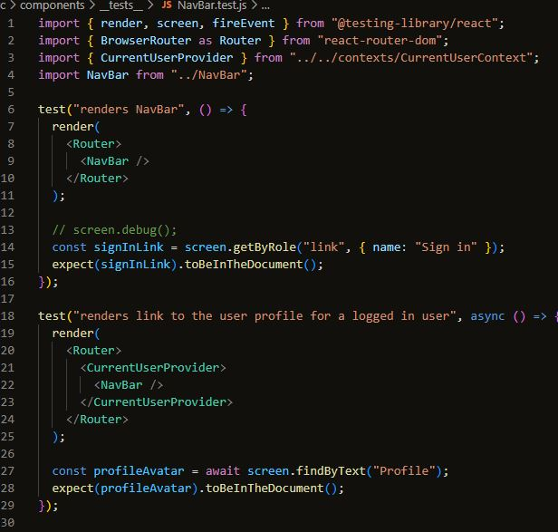
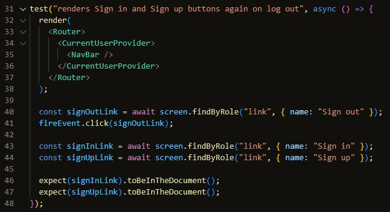

## Manual Testing

- #### Sign Up
    - Checked that a new user can enter credentials to make a new account

    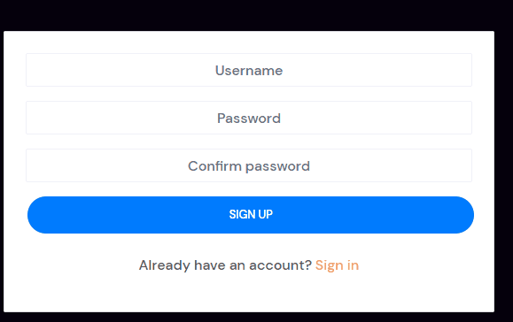

- #### Sign In
    - Checked that a new user can enter their username and password to login into their account

    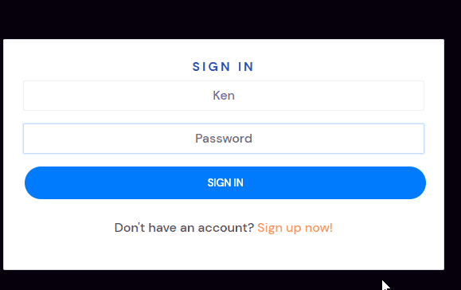

- #### Sign Out
    - Checked the user can click on the sign out button and it signs them out of their account

    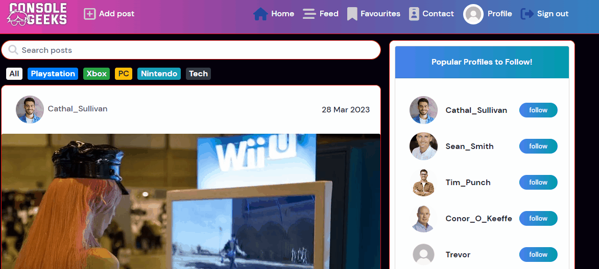

- #### Navigation Bar
    - Checked that all links worked correctly and were directing the user to the correct page

    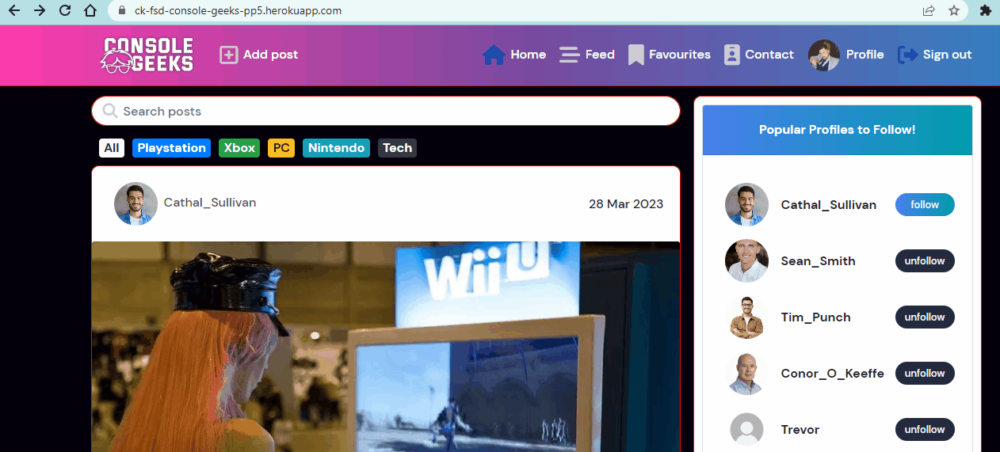

- #### Search Bar
    - Checked that you can search a post by typing into the search bar

    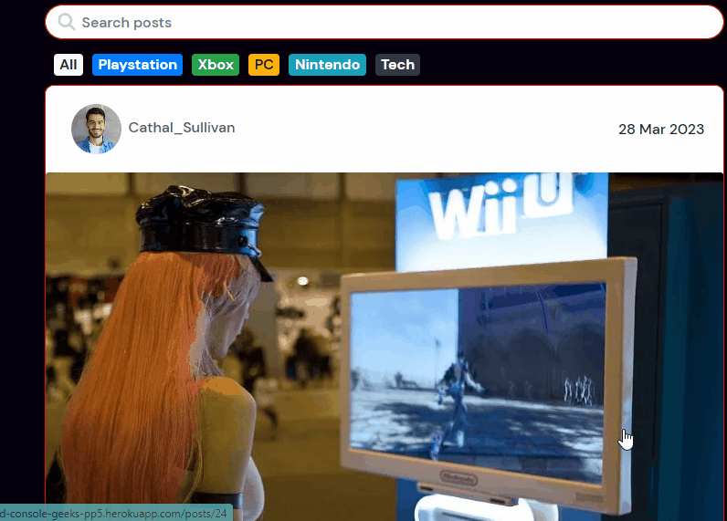

- #### Category Filter
    - Checked that if you clicked on the filter badges, it does indeed filter the posts by category

    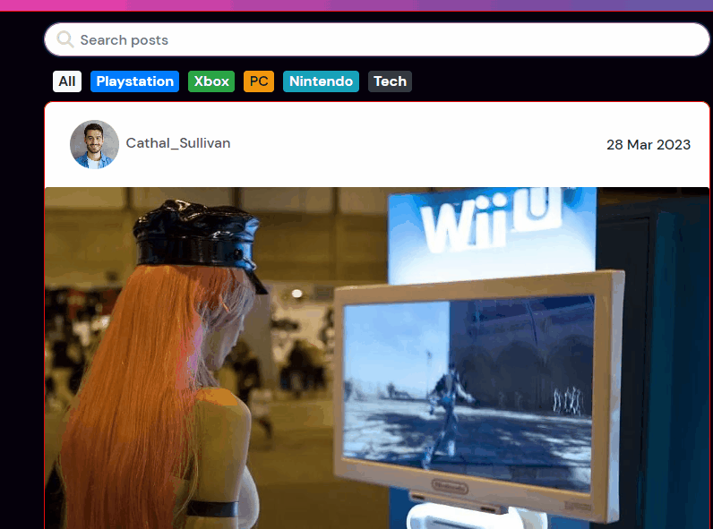

- #### Like / Unlike
    - Checked that you can like and unlike a post

    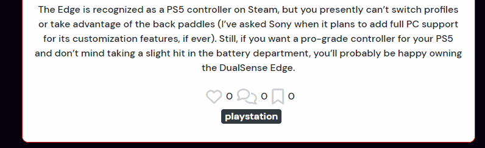

- #### Comment
    - Checked that you can leave a comment on other users posts

    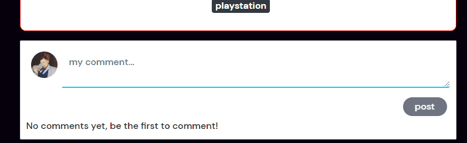

- #### Comment Edit
    - Checked that you can edit a comment that you have left yourself on another users post

    

- #### Comment Delete
    - Checked that you can delete a comment you made on other users posts.

    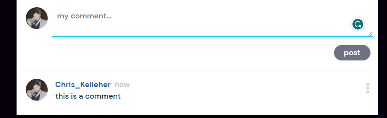

- #### Favourite
    - Checked that you can favourite a post and it shows up in your favourite list

    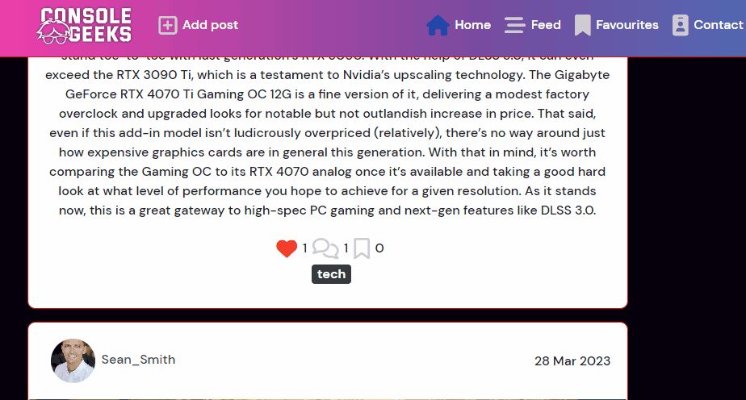

- #### Add a Post
    - Checked that you can add a post successfully

    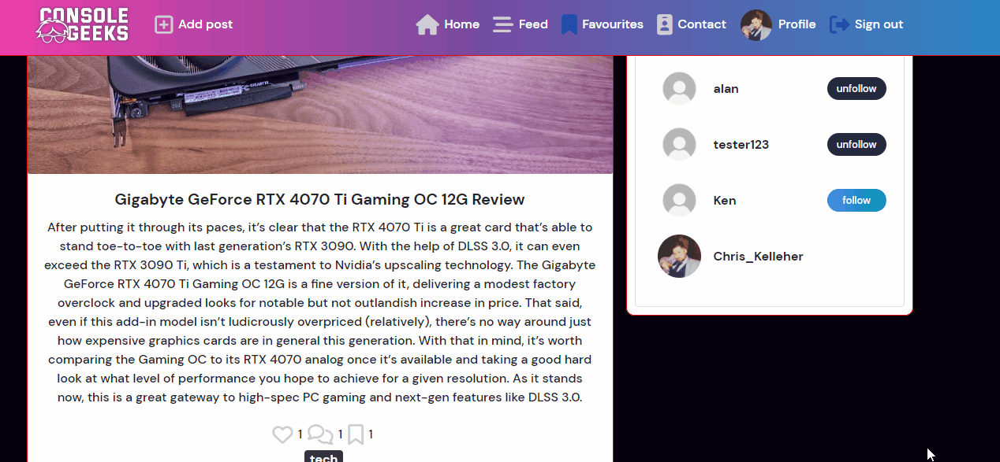
    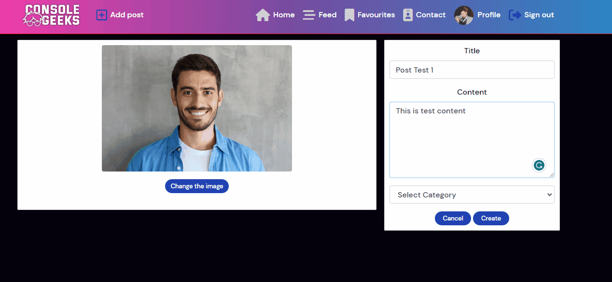

- #### Edit a Post
    - Checked you can edit the details on a post you created

    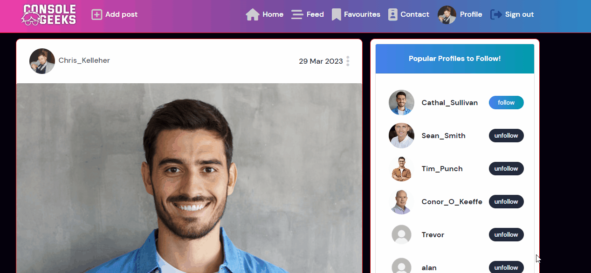

- #### Delete a Post
    - Checked that you can delete a post you created

    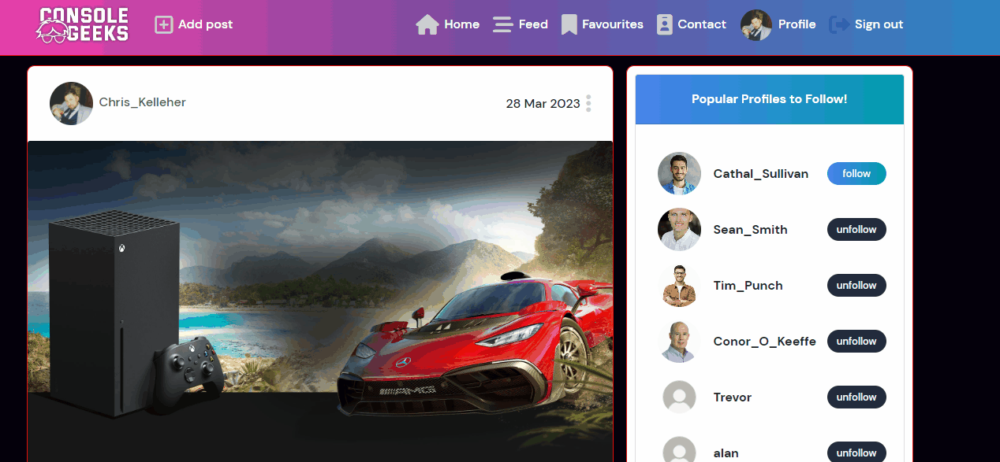

- #### Edit Profile
    - Checked you can edit the information on your profile

    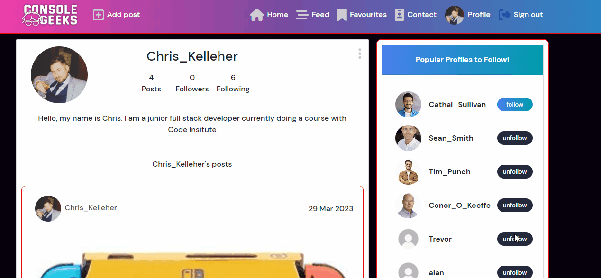

- #### Follow / Unfollow Other Profiles
    - Checked you can follow and unfollow other users

    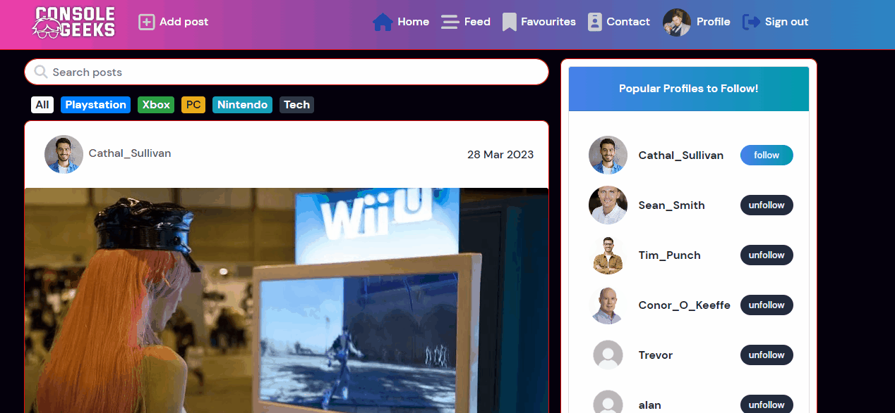

- #### Contact Form
    - Checked that you can fill out the contact form and it works

    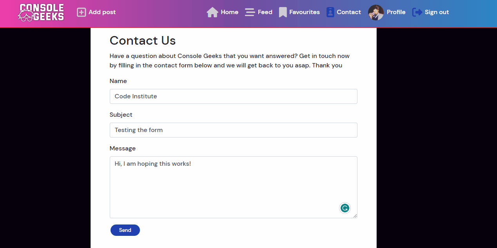